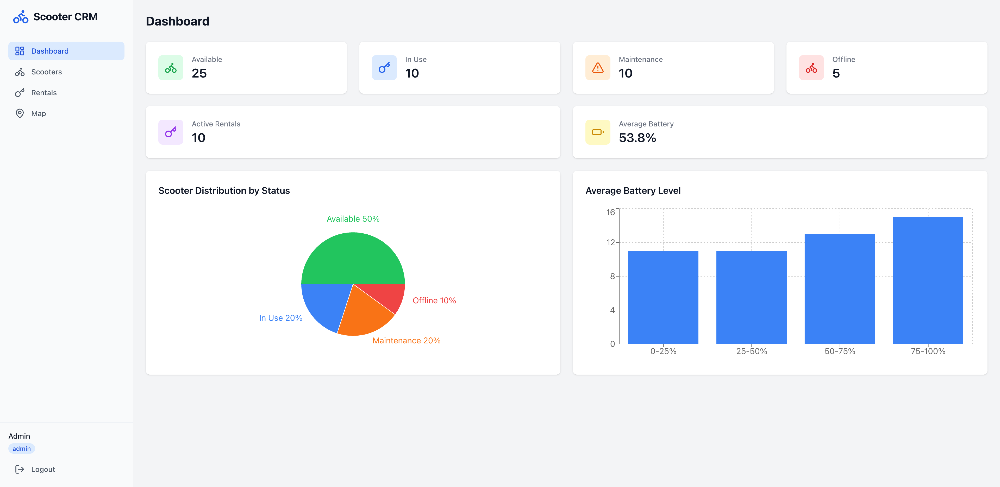
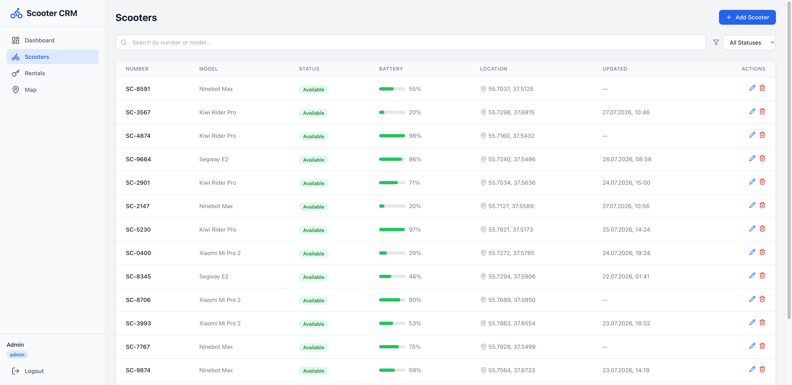
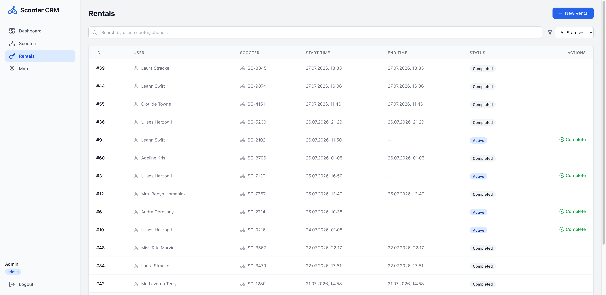
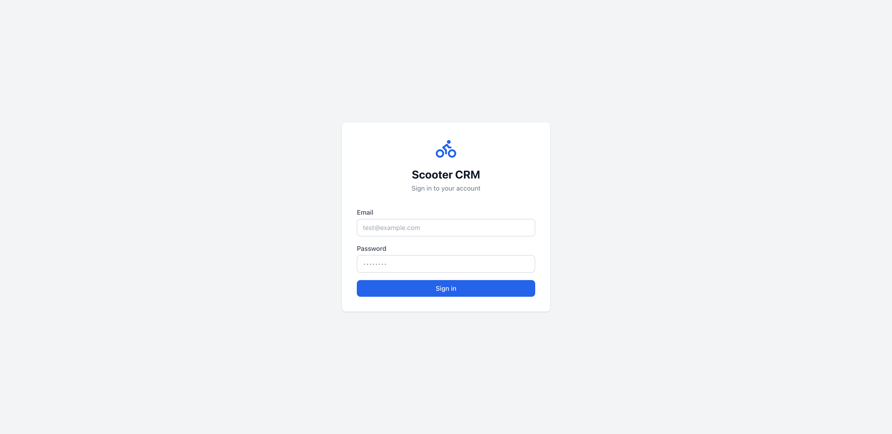
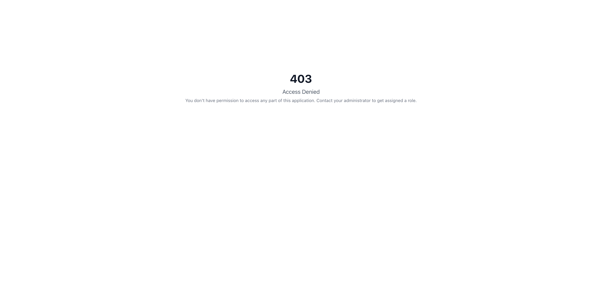
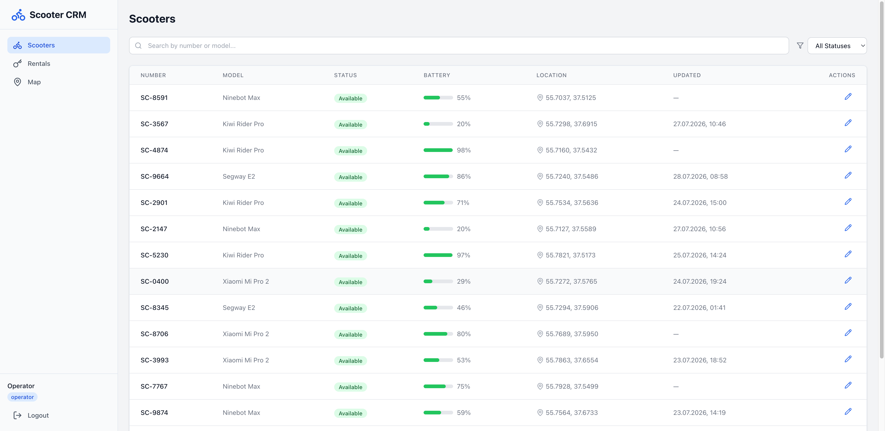

# Scooter CRM

Production-ready система управления арендой самокатов на Laravel 12 + React + TypeScript.

## Скриншоты

### Dashboard


### Управление самокатами


### Управление арендами


### Карта с самокатами


### Авторизация


### Ограничение доступа (403)


### RBAC — Разные роли, разный доступ

**Admin** — полный доступ ко всем функциям:


**Operator** — редактирование самокатов и управление арендами (без Dashboard и удаления):


**User** — только просмотр Dashboard, Scooters и Map (без кнопок управления):


## Технологический стек

### Backend
- **PHP 8.3+**
- **Laravel 12 LTS**
- **PostgreSQL 16**
- **Laravel Sanctum** — Аутентификация API
- **Spatie Laravel Permission** — RBAC (роли и разрешения)
- **FormRequest** — Валидация
- **API Resources** — Форматирование ответов
- **Service Layer** — Бизнес-логика
- **DTO** — Объекты передачи данных
- **Enum** — Типизированные значения статусов
- **Policies** — Авторизация

### Frontend
- **React 18** + **TypeScript**
- **Vite 6** — Сборщик
- **React Router 6** — Клиентская маршрутизация
- **TanStack Query** — Управление серверным состоянием
- **Axios** — HTTP-клиент
- **React Hook Form** + **Zod** — Обработка и валидация форм
- **TailwindCSS** — Стилизация
- **Recharts** — Графики аналитики
- **React Leaflet** — Визуализация карты

### Инфраструктура
- **Docker Compose**
- **Nginx** — Обратный прокси
- **PHP-FPM** — PHP--runtime
- **PostgreSQL** — База данных

## Архитектура

```
scooter-crm/
├── app/
│   ├── Console/           # Artisan команды
│   ├── DTO/               # Объекты передачи данных
│   ├── Enums/             # ScooterStatus, RentalStatus
│   ├── Exceptions/        # Кастомные обработчики исключений
│   ├── Http/
│   │   ├── Controllers/   # Тонкие контроллеры (только API)
│   │   ├── Requests/      # Валидация FormRequest
│   │   └── Resources/     # API Resources
│   ├── Models/            # Eloquent модели (User с HasRoles)
│   ├── Policies/          # Политики авторизации
│   └── Services/          # Слой бизнес-логики
├── database/
│   ├── factories/         # Фабрики для тестовых данных
│   ├── migrations/        # Миграции (включая permission)
│   └── seeders/           # Сидеры (PermissionSeeder, RoleSeeder, AdminSeeder)
├── config/
│   └── permission.php     # Конфигурация Spatie Permission
├── docker/
│   ├── nginx/             # Конфигурация Nginx
│   └── php/               # Dockerfile PHP-FPM
├── resources/
│   └── js/                # React фронтенд
│       ├── components/    # Переиспользуемые UI-компоненты
│       │   ├── RequirePermission.tsx  # Защита маршрутов по разрешениям
│       │   └── AccessDeniedPage.tsx   # Страница 403
│       ├── contexts/      # React контексты
│       │   └── AuthContext.tsx        # Авторизация + метод can()
│       ├── features/      # Фича-модули (scooters, rentals, dashboard)
│       ├── hooks/         # Пользовательские React хуки
│       ├── pages/         # Компоненты страниц
│       ├── services/      # API-слой сервисов
│       ├── types/         # TypeScript типы
│       └── utils/         # Утилиты
├── routes/
│   └── api.php            # API маршруты с middleware permission:
├── tests/
│   └── Feature/           # Feature тесты (PermissionTest — 25 тестов)
└── docker-compose.yml     # Docker-оркестрация
```

## Быстрый старт

### Предварительные требования
- Docker и Docker Compose

### Установка одной командой
```bash
git clone https://github.com/tigranadamyan/scooter-crm.git && cd scooter-crm && ./setup.sh
```

Скрипт `setup.sh` автоматически:
1. Запускает Docker контейнеры
2. Устанавливает зависимости (Composer + npm)
3. Настраивает окружение (.env + ключ)
4. Запускает миграции и сидирование
5. Собирает фронтенд

### Доступ
- **Фронтенд:** http://localhost:8888
- **API:** http://localhost:8888/api

## Документация API

### Аутентификация
```bash
# Получение токена
POST /api/login
{
  "email": "test@example.com",
  "password": "password"
}

# Ответ:
{
  "user": {
    "id": 1,
    "name": "Admin",
    "email": "admin@scooter-crm.test",
    "roles": ["admin"],
    "permissions": ["users.view", "users.manage", "scooters.view", ...]
  },
  "token": "2|..."
}
```

### Тестовые аккаунты

| Роль | Email | Пароль | Разрешения |
|------|-------|--------|------------|
| **admin** | admin@scooter-crm.test | password | Все разрешения (10) |
| **operator** | operator@scooter-crm.test | password | scooters.view, scooters.update, rentals.view, rentals.create, rentals.complete |
| **manager** | manager@scooter-crm.test | password | dashboard.view, scooters.view |
| **user** | user@test.com | password | dashboard.view, scooters.view |
| **admin (тест)** | test@example.com | password | Все разрешения (10) |

### RBAC — Роли и разрешения

Система ролей и разрешений построена на **Spatie Laravel Permission**.

#### Разрешения

| Разрешение | Описание |
|------------|----------|
| `dashboard.view` | Просмотр панели управления |
| `scooters.view` | Просмотр списка самокатов |
| `scooters.create` | Создание самокатов |
| `scooters.update` | Редактирование самокатов |
| `scooters.delete` | Удаление самокатов |
| `rentals.view` | Просмотр аренд |
| `rentals.create` | Создание аренд |
| `rentals.complete` | Завершение аренд |
| `users.view` | Просмотр пользователей |
| `users.manage` | Управление пользователями |

#### Роли

| Роль | Разрешения |
|------|------------|
| **admin** | Все 10 разрешений |
| **operator** | scooters.view, scooters.update, rentals.view, rentals.create, rentals.complete |
| **manager** | dashboard.view, scooters.view |
| **user** | dashboard.view, scooters.view |

### Самокаты

| Метод | Эндпоинт | Описание |
|-------|----------|----------|
| GET | `/api/scooters` | Список самокатов (пагинация) |
| GET | `/api/scooters/{id}` | Получить самокат |
| POST | `/api/scooters` | Создать самокат |
| PUT | `/api/scooters/{id}` | Обновить самокат |
| DELETE | `/api/scooters/{id}` | Удалить самокат |

**Параметры запроса:**
- `search` — Поиск по номеру или модели
- `status` — Фильтр по статусу (available, in_use, maintenance, offline)
- `battery_min` — Минимальный уровень заряда
- `battery_max` — Максимальный уровень заряда
- `sort` — Поле сортировки (number, model, status, battery_level, created_at)
- `direction` — Направление сортировки (asc, desc)
- `per_page` — Результатов на страницу (по умолчанию: 15)

### Аренды

| Метод | Эндпоинт | Описание |
|-------|----------|----------|
| GET | `/api/rentals` | Список аренд (пагинация) |
| GET | `/api/rentals/{id}` | Получить аренду |
| POST | `/api/rentals` | Создать аренду |
| PATCH | `/api/rentals/{id}/complete` | Завершить аренду |

**Параметры запроса:**
- `search` — Поиск по имени пользователя, телефону, номеру самоката
- `status` — Фильтр по статусу (active, completed)
- `user_id` — Фильтр по пользователю
- `scooter_id` — Фильтр по самокату

### Панель управления

| Метод | Эндпоинт | Описание |
|-------|----------|----------|
| GET | `/api/dashboard` | Статистика панели управления |

**Ответ:**
```json
{
  "data": {
    "scooters": {
      "available": 25,
      "in_use": 10,
      "maintenance": 10,
      "offline": 5
    },
    "active_rentals": 10,
    "average_battery": 53.8,
    "battery_distribution": [
      { "name": "0-25%", "count": 11 },
      { "name": "25-50%", "count": 11 },
      { "name": "50-75%", "count": 13 },
      { "name": "75-100%", "count": 15 }
    ]
  }
}
```

## Примеры API-запросов

### Список самокатов
```bash
curl -X GET "http://localhost:8888/api/scooters?status=available&per_page=10" \
  -H "Authorization: Bearer ВАШ_ТОКЕН"
```

### Создание аренды
```bash
curl -X POST "http://localhost:8888/api/rentals" \
  -H "Authorization: Bearer ВАШ_ТОКЕН" \
  -H "Content-Type: application/json" \
  -d '{"user_id": 1, "scooter_id": 5}'
```

### Завершение аренды
```bash
curl -X PATCH "http://localhost:8888/api/rentals/1/complete" \
  -H "Authorization: Bearer ВАШ_ТОКЕН"
```

## Архитектурные решения

### 1. Паттерн Service Layer
Вся бизнес-логика находится в сервисах, что делает контроллеры тонкими. Это обеспечивает:
- Простое unit-тестирование
- Переиспользование кода между контроллерами
- Чёткое разделение ответственности

### 2. Валидация FormRequest
Логика валидации инкапсулирована в отдельных классах FormRequest, включая сложные бизнес-правила, такие как ограничения при создании аренды.

### 3. API Resources
Единый формат JSON-ответов с помощью Laravel API Resources обеспечивает:
- Единообразную структуру данных
- Удобное потребление фронтендом
- Версионирование ответов API

### 4. Паттерн DTO
Объекты передачи данных обеспечивают типизированную обработку данных между слоями, уменьшая ошибки и улучшая поддержку IDE.

### 5. Enum для статусов
Использование PHP 8.1 Enum для полей статусов обеспечивает:
- Типобезопасность
- Автодополнение в IDE
- Чёткую документацию допустимых состояний

### 6. RBAC (Role-Based Access Control)
Полноценная система ролей и разрешений на базе **Spatie Laravel Permission**:
- 4 роли: admin, operator, manager, user
- 10 разрешений на CRUD-операции
- Middleware `permission:` на каждом API-маршруте
- Фронтенд: `RequirePermission` компонент для защиты маршрутов
- Фронтенд: метод `can(permission)` в AuthContext для условного рендеринга
- Ответ 403 с `INSUFFICIENT_PERMISSION` при недостаточных правах

### 7. Архитектура опроса (Polling)
Фронтенд использует `refetchInterval` из TanStack Query для опроса каждые 10 секунд. Это легко заменить на WebSocket:
1. Добавить broadcast-слушатель на бэкенде
2. Использовать `refetchOnWindowFocus` из TanStack Query с событиями WebSocket

### 8. Feature-Based фронтенд
React-компоненты организованы по фичам (scooters, rentals, dashboard), а не по типу, что улучшает навигацию по коду и его сопровождение.

## Разработка

### Команды backend
```bash
# Запуск тестов
docker compose exec php php artisan test

# Запуск тестов конкретного класса
docker compose exec php php artisan test tests/Feature/PermissionTest.php

# Запуск миграций
docker compose exec php php artisan migrate

# Сидирование базы данных
docker compose exec php php artisan db:seed

# Очистка кэша
docker compose exec php php artisan cache:clear
```

### Команды frontend
```bash
# Сервер разработки
docker compose exec php npm run dev

# Сборка
docker compose exec php npm run build

# Линтер
docker compose exec php npm run lint

# Проверка типов
docker compose exec php npm run types:check
```

## Лицензия

MIT
